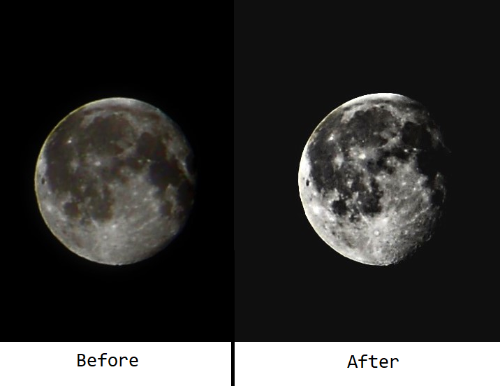

This was the last first day I would have at NYU, and I learned about Open Source Software and its history. 

When I first heard the term open-source, I assumed it meant free (monetary) software, but then quickly learned that is not what open-source software means. When I first interacted with GitHub, there were terms there that I really did not understand, like what it would mean to have an MIT License for my repository, if the code should be public or not, and what forking was. I wanted to learn more about open-source software because the idea of sharing is so inherently human to me, and it has been the cornerstone of some of the most important scientific inventions in the world (like Galileo and the telescope). So I am definitely curious to know more, and it's nice to know everyone else in the room is also willing to share information and communicate well. 

Open Source Software has an interesting philosophy guiding it, that reminds me of Chef Gusteau's motto from the Pixar movie *Ratatouille* which is - **"anyone can cook"** . Open Source opens up every aspect of development, debugging, testing, suggesting to anyone with an interest in making a difference. This enables the piece of software to evolve into a product that is liked and good, because the users are actually invested in making it an improved product because of communication within this new community. Of course, there are issues that can arise, such as incessant contribution requests that might not make sense, poorly executed but well intentioned contributions, lack of effective communication, etc. These can be addressed with various tools such as a Code of Conduct, certain criteria needed to be eligible to make a contribution, proper documentation on the history of requests so it's not repetitive, amongst other things. 

For Closed Source Software (Proprietary), my assumption of it is that it is much more corporate, and possibly more secure. It has a specific number of contributors within a certain team, and only they have read/write access to the code.  In case a user has an issue with the software, only the developers can help change the code. This does not exactly foster a community setting in my opinion. 

### **Projects**

Growing up, I heavily relied on [Wikipedia](https://www.wikipedia.org/) for all my searches, and I may have submitted a few requests to the Barbie page, but they were rejected. Now, I use [Paint.Net](https://www.getpaint.net/index.html) quite frequently to edit pictures, and it was open-source until 2009, after which point it became closed-source. 

I usually edit pictures of the moon that I click myself, using Paint.Net. Here's an example of an edit:

I also used [PuTTY](https://www.putty.org/) more recently to access the CIMS servers here at NYU, because I was enrolled in Introduction To Web Design and needed to login to my account.  Another open source software I have used for around 11 years now is [Archive Of Our Own](https://en.wikipedia.org/wiki/Archive_of_Our_Own#:~:text=Archive%20of%20Our%20Own%20(often,into%20open%20beta%20in%202009.), which is referred to as AO3. It's a fanfiction repository, that is contributed to by fans of movies/books/shows. 

Until recently, I did not know most of the software I used was open-source, and am excited to learn more about how it works and how I can also contribute to different projects :)

